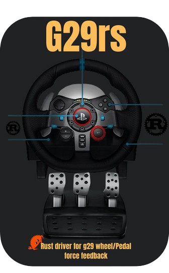

# G29rs 


  
   
Rust driver for Logitech G29 



This library provides a Rust interface for Logitech G29 wheel/pedal and force feedback control. 

# Prerequisites
 - Hidapi : "2.5.0"

# How to use 

```rust
 use g29::controller::Controller;

 fn main() {
     // Create a new G29 instance
     let mut g29 = Controller::new();
     // set force feedback for G29 controller - make sure to set the Logitech to PS3 Mode
     g29.g29.lock().unwrap().force_feedback_constant(0.6);
     // Start the reading thread to continuously read input from the G29 device
     g29.start_pumping();
     loop {
           println!("steering = {:?}", g29.g29.lock().unwrap().get_state());
      }
 }
```

 Interacting with the driver without starting a thread to set force feedback.

```rust
 use g29::interface::G29Interface;

 fn main() {
     // Create a new G29 driver instance
     let mut g29 = G29Interface::new();
     // set ForceFeedback
     g29.force_feedback_constant(0.5);

     // Reset the G29 device, including steering wheel calibration
     g29.reset();

     // Example: Set autocenter with a strength of 0.5 and a rate of 0.05
     g29.set_autocenter(0.5, 0.05);

 }
```
Reading input from the Logitech G29 in the main thread , and geting the state input in carla format

```rust
 use g29::controller::Controller;

 fn main() {
    // Create a new G29 instance
    let mut g29 = Controller::new();
   // set G29 Steer to the center 
    g29.g29.lock().unwrap().set_autocenter(0.5,0.05);
    // reading 
   loop {
      // reading every 10ms from the G29
      g29.g29.lock().unwrap().pump(10);
      // get the readed values 
      println!("Carla_controle = {:?}", g29.g29.lock().unwrap().carla_vehicle_controle());
    }
 }
```

# TODO

- [x] Thread for reading data from G29
- [ ] Writing Test
- [x] Make it as Lib after testing the full code 
- [ ] Reading reverse mode from buttons in the G29 controller 
- [x] Make methode to transform the State for Carla user "throttle  [0 -> 1] brake [0 -> 1] brake[0->1]"

# Contributing
Contributions are welcome! If you have improvements, bug fixes, or new features to propose, please submit a pull request.


# support

Only G29 logitech controller Driving wheel/pedals is supported for now, and also the force Feedback with the PS3 mode

Support Force feedback

Buy me a Coffee : [paypal](paypal.me/LBoulbalah)
